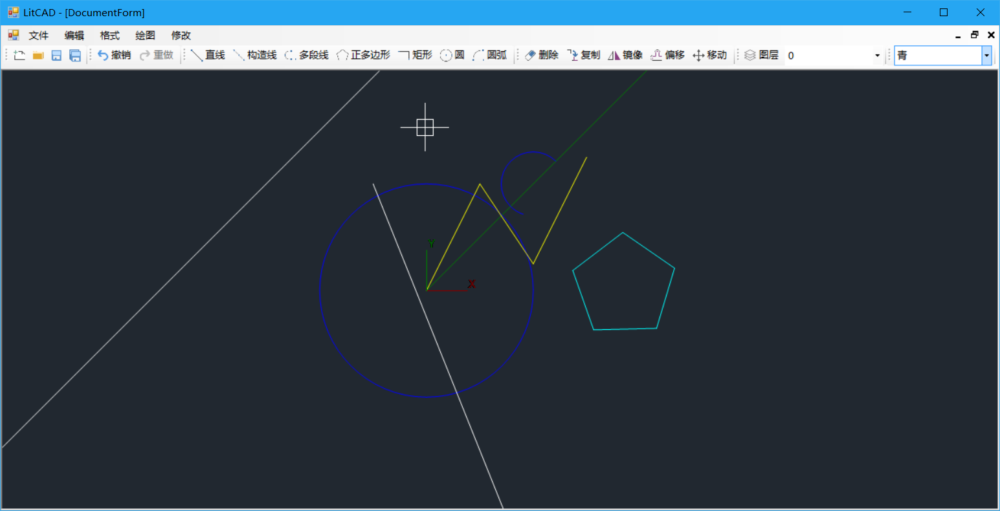

# LitCAD
LitCAD is a very simple 2D CAD drawing application developed by C#.

LitCAD是使用C#开发的，一款非常简单的二维CAD绘图程序。

LitCAD is free software; you can redistribute it and/or modify it under the terms of the [MIT License](https://opensource.org/licenses/MIT).

LitCAD是自由软件，你可以在遵守 MIT 协议下再分发或修改该软件。

#### Building 编译

Download the source code and open ./src/LitCAD.sln by Visual Studio 2010, then you can directly compile and build this project.

下载源码，然后使用VS2010 打开解决方案：./src/LitCAD.sln，直接编译即可。

#### Main Features 主要特征

* Supports entities: line, xline, ray, polyline, cirlce, arc, text.

  支持多种图元：线段、构造线、射线、多段线、圆、圆弧、文字。

* Zoom and pan.

  缩放和平移视图。

* Layer。

  支持图层。

* Grip points.

  图元支持夹点，并且可以通过移动夹点来修改图元。

* Snap.

  捕捉。目前支持的捕捉类型有：端点、中点、中心点、象限点。

* Basic editing tools: delete, copy, mirror, offset, move.

  基本的编辑操作：删除、复制、镜像、偏移、移动。

* Undo and Redo.

  撤销和重做。

* Multiple Ways For Object Selection: Pick Single、Window、Cross.

  支持点选和框选来选择图元。

* Open and Save *.litcad file.

  支持打开和保存为 *.litcad 文件。

#### Entities supported 支持的图元

* line 线段
* xline 构造线
* ray 射线
* polyline 多段线
* circle 圆
* arc 圆弧
* text 文字

# LICENSE

This project is licensed under the [MIT License](LICENSE).
